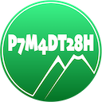

Swift xsd:duration Parser Extensions
=

Introduction
-

This set of extensions allows us to easily parse duration values, as expressed in XML documents that expect their duration values to be in [the standard xsd:duration format](https://www.w3.org/TR/xmlschema11-2/#duration).

[This page does a fairly good job of explaining the format.](http://www.datypic.com/sc/xsd/t-xsd_duration.html)

What Problem Does This Solve?
-

The duration format has a number of ways that it can be expressed, and this set of extensions should allow us to deal with all of them. It will be most useful integrated into an XML parser.
It will read a duration from a [String](https://developer.apple.com/documentation/swift/string) instance, and return a [DateComponents](https://developer.apple.com/documentation/foundation/datecomponents) instance, representing the duration in that String.
You can also do the reverse, and take a DateComponents instance, and express it as a properly-formatted xsd:duration String.

Requirements
-

It should work fine for osx, tvOS and iOS. It only depends on the Swift Foundation library.

This requires Swift Version 4.0 or above (tested with 4.2).

WHERE TO GET
=
[Here is the GitHub Repo for This Project.](https://github.com/RiftValleySoftware/RVS_ParseXMLDuration)

[Here is the online documentation page for this project.](https://riftvalleysoftware.com/work/open-source-projects/#RVS_ParseXMLDuration)

USAGE
=

Include the Source in Your Project
-

This is a simple source file; not a module.

To use this, simply add the [RVS_ParseXMLDuration/RVS_ParseXMLDuration.swift](https://github.com/RiftValleySoftware/RVS_ParseXMLDuration/blob/master/RVS_ParseXMLDuration/RVS_ParseXMLDuration.swift) file to your project; copying it wherever you want.

This will add one function: `asXMLDuration`, to the [String](https://developer.apple.com/documentation/swift/string) struct, and to the [DateComponents](https://developer.apple.com/documentation/foundation/datecomponents) struct.

The String variant will return an optional DateComponents result (a parsed string), and the DateComponents variant will return an optional String (a properly-formatted xsd:duration string).

All the rest of the stuff is for testing, validating and sharing.

DEPENDENCIES
=

There are no dependencies to use RVS_IPAddress in your project. In order to test it and run it in the module project, you should use [CocoaPods](https://cocoapods.org) to install [SwiftLint](https://cocoapods.org/pods/SwiftLint), although that is not required. It's [just good practice](https://littlegreenviper.com/series/swiftwater/swiftlint/).

LICENSE
=
MIT License

Permission is hereby granted, free of charge, to any person obtaining a copy of this software and associated documentation
files (the "Software"), to deal in the Software without restriction, including without limitation the rights to use, copy,
modify, merge, publish, distribute, sublicense, and/or sell copies of the Software, and to permit persons to whom the
Software is furnished to do so, subject to the following conditions:

The above copyright notice and this permission notice shall be included in all copies or substantial portions of the Software.

THE SOFTWARE IS PROVIDED "AS IS", WITHOUT WARRANTY OF ANY KIND, EXPRESS OR IMPLIED, INCLUDING BUT NOT LIMITED TO THE WARRANTIES
OF MERCHANTABILITY, FITNESS FOR A PARTICULAR PURPOSE AND NONINFRINGEMENT.
IN NO EVENT SHALL THE AUTHORS OR COPYRIGHT HOLDERS BE LIABLE FOR ANY CLAIM, DAMAGES OR OTHER LIABILITY, WHETHER IN AN ACTION OF
CONTRACT, TORT OR OTHERWISE, ARISING FROM, OUT OF OR IN CONNECTION WITH THE SOFTWARE OR THE USE OR OTHER DEALINGS IN THE SOFTWARE.

[The Great Rift Valley Software Company: https://riftvalleysoftware.com](https://riftvalleysoftware.com)

